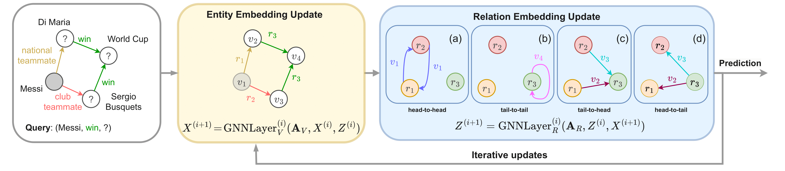

# TRIX

## Overview


This is the code for [TRIX: A More Expressive Model for Zero-shot Domain Transfer in Knowledge Graphs](https://openreview.net/forum?id=mRB0XkewKW). TRIX (Transferable Relation-Entity Interactions in crossing patterns (X-patterns)) is a fully inductive model for entity prediction tasks and relation prediction tasks over knowledge graphs. It is strictly more expressive than previous fully inductive methods and achieves state-of-the-art prediction performance over 57 knowledge graph datasets.

## Installation
```bash
pip install -r requirements.txt
```

## Pretraining
The pretraining of TRIX is done on the FB15k237, WN18RR, CoDExMedium datasets. The entity prediction model and the relation prediction model are trained separately.

Pre-training on 3 graphs for the entity prediction model:

```bash
python ./src/pretrain_entity.py -c ./config/pretrain_entity.yaml --gpus [0]
```

Pre-training on 3 graphs for the relation prediction model:

```bash
python ./src/pretrain_relation.py -c ./config/pretrain_relation.yaml --gpus [0]
```
## Inference
The run_entity.py and run_relation.py are the scripts for the entity prediction and the relation prediction respectively.

* `--dataset`: the dataset name.
* `--version`: a version of the dataset if it has multiple versions.
* `--epochs`: number of epochs to train. If it is 0, it's zero-shot inference; if it is larger than 0, it's inference with fine-tuning.
* `--bpe`: batches per epoch.

### Zero-shot Inference
Zero-shot Inference for the entity prediction task:
```bash
python ./src/run_entity.py -c ./config/run_entity_transductive.yaml --dataset CoDExSmall --epochs 0 --bpe null --gpus [0] --ckpt /path/to/checkpoint

python ./src/run_entity.py -c ./config/run_entity_inductive.yaml --dataset FB15k237Inductive --version v1 --epochs 0 --bpe null --gpus [0] --ckpt /path/to/checkpoint
```

Zero-shot Inference for the relation prediction task:
```bash
python ./src/run_relation.py -c ./config/run_relation_transductive.yaml --dataset CoDExSmall --epochs 0 --bpe null --gpus [0] --ckpt /path/to/checkpoint

python ./src/run_relation.py -c ./config/run_relation_inductive.yaml --dataset FB15k237Inductive --version v1 --epochs 0 --bpe null --gpus [0] --ckpt /path/to/checkpoint
```

### Inference with Fine-tuning
Inference with fine-tuning for the entity prediction task:
```bash
python ./src/run_entity.py -c ./config/run_entity_transductive.yaml --dataset CoDExSmall --epochs 3 --bpe 1000 --gpus [0] --ckpt /path/to/checkpoint

python ./src/run_entity.py -c ./config/run_entity_inductive.yaml --dataset FB15k237Inductive --version v1 --epochs 3 --bpe 1000 --gpus [0] --ckpt /path/to/checkpoint
```

Inference with fine-tuning for the relation prediction task:
```bash
python ./src/run_relation.py -c ./config/run_relation_transductive.yaml --dataset CoDExSmall --epochs 3 --bpe 1000 --gpus [0] --ckpt /path/to/checkpoint

python ./src/run_relation.py -c ./config/run_relation_inductive.yaml --dataset FB15k237Inductive --version v1 --epochs 3 --bpe 1000 --gpus [0] --ckpt /path/to/checkpoint
```

## LLM Experiment
Please download the CoDEx dataset from [CoDEx](https://github.com/tsafavi/codex).

Inferences of relation prediction tasks and entity prediction tasks with Gemini on CoDEx-S dataset:
```bash
python ./llm/run_relation_task_1.py

python ./llm/run_relation_task_2.py

python ./llm/run_relation_task_3.py

python ./llm/run_entity_task_1.py

python ./llm/run_entity_task_2.py

python ./llm/run_entity_task_3.py
```

## Citation ##

If you find this codebase useful in your research, please cite the original paper.

The main TRIX paper:

```bibtex
@inproceedings{zhang2024trix,
    title={TRIX: A More Expressive Model for Zero-shot Domain Transfer in Knowledge Graphs},
    author={Yucheng Zhang and Beatrice Bevilacqua and Mikhail Galkin and Bruno Ribeiro},
    booktitle={The Third Learning on Graphs Conference},
    year={2024},
    url={https://openreview.net/forum?id=mRB0XkewKW}
}
```